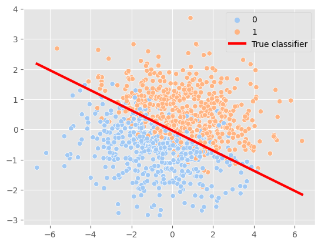
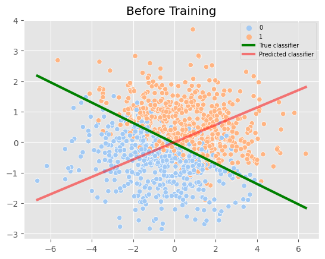
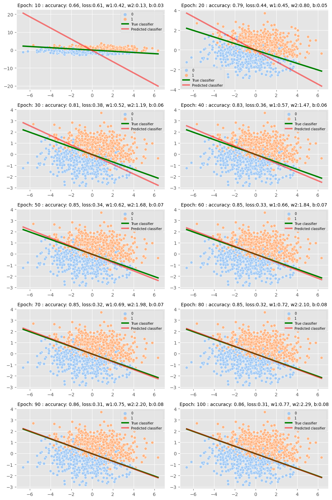

In this blog, we will create a realistic dataset for binary classification. Then, we will use the JAX library along with other JAX-based ecosystem libraries like FLAX and OPTAX to train a LogisticRegression Model.

This is an interesting and helpful blog as it deals with classification instead of regression. Most of the starter blogs on ML try regression examples, which are generally simpler to build but rare in the real world. For classification, most of the blogs start with the MNIST classification dataset, which is images and difficult to comprehend. We also often get >95% accuracy on MNIST.

Our goal in this blog was to prepare a simple but realistic dataset with some randomness that can be tuned if required. The dataset will be generated using a linear boundary and sigmoid probability, similar to how a model learns to classify. The labels for datapoints are sampled based on this probability. At the end, the model should be able to predict the linear boundary with decent accuracy. The accuracy will decrease as we add more randomness.

Open a google colab and start a runtime. CPU is also fine.

```python
! pip install -U jax jaxlib flax optax
```


```python
import jax
import jax.numpy as jnp
import flax.linen as nn
import optax

import numpy as np
import seaborn as sns
import pandas as pd
import matplotlib.pyplot as plt
plt.style.use('ggplot')
```

## Create dataset whose classes are linearly separable. $w1 *x +w2 * y + b$
```python
# Line parameters
# Multiplying the weights with a scalar will change randomness keeping the boundary constant
w1, w2, b = (1,3,0.1) 

def get_y(x, w1, w2, b):
  return -(w1*x + b)/w2
def get_distance(x, y):
  """Finds distance of point (x,y)  from line $w1 *x +w2 * y + b$"""
  return (w1 * x+ w2*y +b) #/ np.linalg.norm([w1, w2]) - intentionally not normalizing as the model does the same.
def sigmoid(x):
  return 1/(1 + np.exp(-x))
def positive_prob(distance):
  """Applies sigmoid to the distance.
  
  Args:
    distance: Distance of point from the line.
              Distance 0 will be 50-50 probability.
              Positive distance will result in p >0.5
  """
  p= sigmoid(distance)
  return float(format(p,".2f"))
def get_class(positive_prob):
  """Samples labels based on probability.

    Args:
      positive_prob: probability that label is 1
  """
  return np.random.choice([1,0], size = None, p = [positive_prob,1-positive_prob])

# Random dataset sampled from a gaussian distribution.
x = np.random.normal(0,2, size = (1000,))
y = np.random.normal(0,1, size = (1000,))

df = pd.DataFrame({'x': x,'y':y})

df['distance'] = df.apply(lambda row: get_distance(row.x, row.y), axis = 1)
df['label'] = df.distance.apply( lambda d: get_class(positive_prob(d)))

# couple of points on the line needed to plot.
online_x = np.array([x.min(), x.max()])
online_y = get_y(online_x, w1, w2, b)

sns.scatterplot(df, x= x, y = y, hue = 'label', palette = 'pastel')
sns.lineplot(x= online_x, y = online_y, color = 'red', linewidth = 3, label = 'True classifier')
```

    



## Build a logistic regression model using Flax
```python
class LogisticRegressionModel(nn.Module):
  @nn.compact
  def __call__(self, x, y):
    w1 = self.param('w1', init_fn = lambda key: jax.random.normal(key))
    w2 = self.param('w2', init_fn = lambda key: jax.random.normal(key))
    b = self.param('b', init_fn = lambda key: 0.0)

    return w1 * x + w2 * y + b

# model = LogisticRegressionModel()
# params = model.init(jax.random.PRNGKey(42), x,y)
# print(params)
# model.apply(params, x = 1, y = 1)
```

## Loss function

We will use Binary cross entropy from optax.
```python

def loss(params, apply_fn, x, y, label):
  """Binary cross entropy."""
  logit = apply_fn(params, x, y)
  return optax.sigmoid_binary_cross_entropy(logit, label)
assert optax.sigmoid_binary_cross_entropy(-1.0,1) > optax.sigmoid_binary_cross_entropy(1.0,1)

```

## Grad function
In jax the gradients are fetched by converting the loss function to grad function. 
```python
value_and_grad = jax.value_and_grad(loss)
value_and_grad_vectorized = jax.vmap(value_and_grad, in_axes = (jax.tree_util.tree_map(lambda x: None, params),None, 0,0,0 ))
# loss, grad = value_and_grad_vectorized(params, model.apply, np.array([0,1.]), np.array([0,1.]), np.array([0,0]))
# print(f'elementwise losses = {loss}\nelement_wise_grad = {grad}')
```

## Update weights function
```python

optimizer = optax.sgd(learning_rate = 0.1)
optimizer_state = optimizer.init(params)

def update_weights(params, optimizer_state, x, y, label,  apply_fn, optimizer):
  loss, grad = value_and_grad_vectorized(params, apply_fn, x, y, label)
  loss = jnp.mean(loss)
  grad = jax.tree_util.tree_map(jnp.mean, grad)
  weight_updates, new_states =  optimizer.update(grad, optimizer_state)
  new_params = optax.apply_updates(params, weight_updates)
  return new_params, new_states , loss
# update_weights(params, optimizer_state, df.x.head(2).values,  df.y.head(2).values,  df.label.head(2).values,
#                model.apply, optimizer)
```

## Metric functions
```python
def accuracy(y_true, y_pred):
  return jnp.mean(y_true == y_pred)
# accuracy(np.array([0,1]),np.array([1,1]))
```

## Train Functions
```python

model = LogisticRegressionModel()
params = model.init(jax.random.PRNGKey(10), x = 1, y = 0.0)
print(f'Initial params : {params}')
optimizer = optax.sgd(learning_rate = 0.3)
optimizer_state = optimizer.init(params)

def train_epoch(params, optimizer_state):
  new_params, new_states, loss = update_weights(params,
                                          optimizer_state,
                                          df.x.values,
                                          df.y.values,
                                          df.label.values,
                                          model.apply,
                                          optimizer)
  logits = model.apply(new_params, df.x.values, df.y.values)
  positive = jnp.array(logits)>0.5
  preds = jnp.array(positive, dtype = int)
  acc = accuracy(df.label.values, preds)
  return new_params, new_states, loss, acc
# train_epoch(params, optimizer_state)

```

    Initial params : FrozenDict({
        params: {
            w1: Array(0.32724857, dtype=float32),
            w2: Array(-1.1509773, dtype=float32),
            b: 0.0,
        },
    })


```python
def plot_result(ax, params, epoch, accuracy, loss):
  p = params['params']
  online_x = np.array([x.min(), x.max()])
  original_y = get_y(online_x, w1,w2,b)

  #Fetch points to plot prediciton boundary based on params.
  w1_n,w2_n,b_n = p['w1'], p['w2'], p['b']
  new_y = get_y(online_x, w1_n, w2_n, b_n)

  sns.scatterplot(df, x= x, y = y, hue = 'label', palette = 'pastel', ax = ax)
  sns.lineplot(x= online_x, y = original_y, color = 'green', linewidth = 3, label='True classifier', ax = ax)
  sns.lineplot(x= online_x, y = new_y, color = 'red', linewidth = 3, label='Predicted classifier', alpha = 0.5, ax = ax)
  ax.legend(fontsize = 7)
  ax.set_title(f'Epoch: {epoch} : accuracy: {accuracy:.2f}, loss:{loss:.2f}, w1:{w1_n:.2f}, w2:{w2_n:.2f}, b:{b_n:.2f}', fontsize = 10)
fig, ax = plt.subplots(1,1,)
plot_result(ax, params, 0,0,0)
ax.set_title('Before Training')
```

    

    


## Train and plot
```python
from tqdm.auto import trange
epochs = 100

fig, axes = plt.subplots(5,2, figsize = (10,15))
axes = axes.flatten()
for epoch in trange(1, epochs+1):
  params, optimizer_states, loss, acc = train_epoch(params, optimizer_state)
  if epoch % 10 == 0:
    plot_result(axes[epoch//10-1], params, epoch, acc, loss)
plt.tight_layout()
```


    



## Conclusion

In this insightful tech blog, we leveraged the power of Jax, Flax and Optax to create a realistic dataset for binary classification, which enabled us to train a Logistic Regression Model with remarkable results. The model successfully learned the linear boundary and accurately classified the datapoints, achieving an impressive 86% accuracy with a loss of 0.31.

Furthermore, we explored the limitations of our model, noting that it became saturated after 100 epochs and could not produce a better boundary. We could have tried a better model, but overfitting can be a concern when using non-linear models, especially when the data is generated from a linear boundary.

It is worth noting that accuracy may not always be 100% due to randomness in the labels, and in such cases, it is essential to consider whether it's the data or the model that needs to be improved. Simply increasing the model size may not always be the solution to achieving better accuracy.

Overall, this blog sheds light on the critical aspects of data creation, randomness, and model selection. We hope that our readers found this informative and gained valuable insights into creating and training models for binary classification.